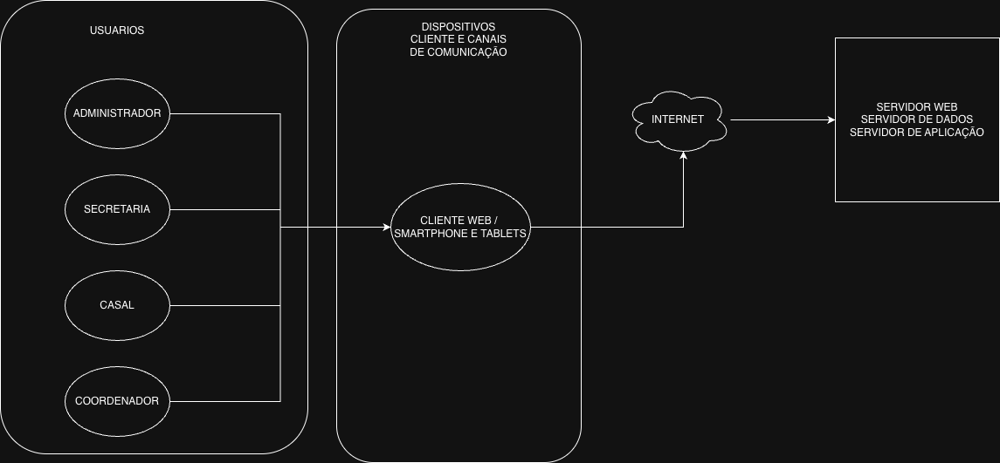

# Documento de Visão

**Versão:** 1.2 
**Data:** 20/10/2025  
**Descrição:** Versão atualizada do documento de visão  
**Autores:** Davi César, Jonas Sarmento, Francisco Viana  

---

## Histórico de Revisões

| Data       | Versão | Descrição                                                           | Autor(es)                               |
|-------------|--------|----------------------------------------------------------------------|------------------------------------------|
| 17/10/2025  | 1.0    | Criação do documento de visão                                       | Davi César, Jonas Sarmento, Francisco Viana |
| 19/10/2025  | 1.1    | Inclusão das seções “Custo e Venda” e atualização de “Licenciamento e Instalação” | Davi César, Jonas Sarmento, Francisco Viana |
| 19/10/2025  | 1.2    | Revisão do conteúdo do documento de visão                           | Davi César, Jonas Sarmento, Francisco Viana |

---

## Sumário

- [1. Introdução](#1-introdução)
  - [1.1. Propósito](#11-propósito)
  - [1.2. Escopo](#12-escopo)
  - [1.3. Definições, Acrônimos e Abreviações](#13-definições-acrônimos-e-abreviações)
- [2. Posicionamento](#2-posicionamento)
  - [2.1. Oportunidade de Negócio](#21-oportunidade-de-negócio)
  - [2.2. Declaração do Problema](#22-declaração-do-problema)
  - [2.3. Declaração de Posição do Produto](#23-declaração-de-posição-do-produto)
- [3. Descrição das Partes Interessadas e dos Usuários](#3-descrição-das-partes-interessadas-e-dos-usuários)
  - [3.1. Resumo das Partes Interessadas](#31-resumo-das-partes-interessadas)
  - [3.2. Perfis de Usuário](#32-perfis-de-usuário)
  - [3.3. Necessidades Principais](#33-necessidades-principais)
  - [3.4. Alternativas e Competição](#34-alternativas-e-competição)
  - [3.5. Descrição dos Stakeholders e dos Usuários](#35-descrição-dos-stakeholders-e-dos-usuários)
  - [3.6. Usuários e Atores](#36-usuários-e-atores)
- [4. Visão Geral do Produto](#4-visão-geral-do-produto)
  - [4.1. Perspectiva do Produto](#41-perspectiva-do-produto)
  - [4.2. Premissas e Dependências](#42-premissas-e-dependências)
  - [4.3. Descrição do Ambiente de Uso](#43-descrição-do-ambiente-de-uso)
  - [4.4. Necessidades Principais quanto ao Ambiente](#44-necessidades-principais-quanto-ao-ambiente)
- [5. Recursos do Produto](#5-recursos-do-produto)
- [6. Restrições](#6-restrições)
- [7. Custo e Venda](#7-custo-e-venda)
- [8. Licenciamento e Instalação](#8-licenciamento-e-instalação)
- [9. Apêndice 1 – Atributos de Recurso](#9-apêndice-1--atributos-de-recurso)

---

## 1. Introdução

### 1.1. Propósito
Este documento define a visão do **Sistema de Controle de Escala Pastoral para Batismos (SCEPB)**, servindo de base para o desenvolvimento e alinhamento entre a equipe e as partes interessadas.

### 1.2. Escopo
O projeto visa criar uma **aplicação web responsiva** para automatizar o controle e visualização da escala de casais responsáveis pelos batismos em uma paróquia.

Principais funcionalidades:
- Gerenciamento de usuários e perfis.  
- Cadastro e controle de casais e batismos.  
- Alocação automática dos casais.  
- Visualização da escala em calendário.  
- Envio de notificações automáticas.  
- Exportação de relatórios e histórico.

O sistema **não incluirá** o controle de outros sacramentos ou eventos religiosos.

### 1.3. Definições, Acrônimos e Abreviações

#### 📘 Definições

| Termo | Definição |
|--------|------------|
| **SCEPB** | Sistema de Controle de Escala Pastoral para Batismos. |
| **Escala Pastoral** | Organização de casais responsáveis por cada celebração de batismo. |
| **Casal** | Membros voluntários da pastoral encarregados de auxiliar nas celebrações. |
| **Secretaria Paroquial** | Funcionário ou voluntário responsável pelo agendamento e comunicação com os casais. |
| **Administrador da Paróquia** | Responsável pela gestão geral e supervisão da pastoral. |
| **Coordenador da Pastoral** | Líder que organiza a escala e acompanha os casais. |

#### 🧩 Acrônimos e Abreviações

| Sigla | Significado |
|--------|-------------|
| **PWA** | Progressive Web App (Aplicativo Web Progressivo) |
| **API** | Application Programming Interface (Interface de Programação de Aplicações) |
| **UI** | User Interface (Interface do Usuário) |
| **UX** | User Experience (Experiência do Usuário) |
| **BD** | Banco de Dados |
| **SCEPB** | Sistema de Controle de Escala Pastoral para Batismos |

---

## 2. Posicionamento

### 2.1. Oportunidade de Negócio
O gerenciamento manual de escalas é suscetível a erros e falta de comunicação. A automação trará eficiência e transparência ao processo pastoral.

### 2.2. Declaração do Problema

| Aspecto | Descrição |
|----------|-----------|
| **Problema** | Falta de um sistema automatizado para controle das escalas de batismo. |
| **Afeta** | Secretaria e casais da pastoral. |
| **Impacto** | Desorganização, retrabalho e falhas na comunicação. |
| **Solução** | Sistema web automatizado com notificações e relatórios. |

### 2.3. Declaração de Posição do Produto
**Para:** a Secretaria Paroquial e os Casais da Pastoral  
**Que necessitam de:** uma forma confiável e prática de organizar as escalas  
**O produto é:** um sistema web automatizado  
**Diferente de:** planilhas e mensagens em grupo  
**Nosso produto oferece:** gestão centralizada, notificações automáticas e transparência.

---

## 3. Descrição das Partes Interessadas e dos Usuários

### 3.1. Resumo das Partes Interessadas

| Parte Interessada | Descrição |
|--------------------|-----------|
| **Administrador da Paróquia** | Supervisiona e garante o bom funcionamento da pastoral. |
| **Secretaria Paroquial** | Usuário principal que cadastra e gerencia escalas. |
| **Coordenador da Pastoral** | Acompanha casais e corrige alocações. |
| **Casais da Pastoral** | Usuários finais que consultam suas escalas. |

### 3.2. Perfis de Usuário

| Perfil | Descrição | Responsabilidades | Habilidade Técnica |
|--------|------------|------------------|--------------------|
| **Administrador** | Gerencia o sistema | Supervisiona usuários e relatórios | Intermediária |
| **Secretaria** | Principal usuária | Cadastra batismos e casais | Básica |
| **Coordenador** | Gestor de casais | Acompanha alocações | Básica |
| **Casal** | Usuário final | Consulta e recebe notificações | Mínima |

### 3.3. Necessidades Principais

| Necessidade | Prioridade | Interessado | Justificativa |
|--------------|-------------|--------------|----------------|
| Automatizar a alocação | Alta | Secretaria | Reduz erros e retrabalho |
| Notificações automáticas | Alta | Casais | Melhora a comunicação |
| Visualização da agenda | Alta | Todos | Facilita a organização |
| Relatórios exportáveis | Média | Secretaria | Controle e transparência |

### 3.4. Alternativas e Competição
Planilhas e grupos de mensagens não oferecem controle, segurança ou automação.  
O SCEPB se destaca por centralizar e simplificar todo o processo.

### 3.5. Descrição dos Stakeholders e dos Usuários

| Stakeholder / Usuário | Papel | Interesse | Expectativas |
|------------------------|--------|------------|---------------|
| **Administrador** | Supervisor geral | Organização | Supervisão e relatórios |
| **Secretaria** | Operadora principal | Automação | Interface prática |
| **Coordenador** | Gestor de casais | Controle de alocação | Ajustes rápidos |
| **Casais** | Usuários finais | Consulta de escalas | Simplicidade |
| **Equipe Técnica** | Desenvolvimento | Estabilidade | Documentação clara |

### 3.6. Usuários e Atores

| Ator | Tipo | Descrição | Interação |
|------|------|------------|-----------|
| **Administrador** | Primário | Supervisiona e gerencia o sistema | Acesso total |
| **Secretaria** | Primário | Cadastra e gerencia escalas | Uso diário |
| **Coordenador** | Secundário | Acompanha casais | Uso pontual |
| **Casais** | Primário | Consultam escalas e notificações | Uso móvel |
| **Sistema de Notificações** | Suporte | Envia mensagens automáticas | Em segundo plano |
| **Banco de Dados** | Suporte | Armazena informações | Permanente |

---

## 4. Visão Geral do Produto

### 4.1. Perspectiva do Produto
Aplicação web independente, acessível por navegadores modernos, com interface responsiva e compatível com dispositivos móveis.

### 4.2. Premissas e Dependências
**Premissas:**
- Acesso à internet.  
- Dados atualizados pela secretaria.  

**Dependências:**
- API de e-mail e WhatsApp.  
- Servidor de hospedagem.  

### 4.3. Descrição do Ambiente de Uso

| Ambiente | Características | Usuários |
|-----------|----------------|-----------|
| Escritório Paroquial | Computadores e rede estável | Secretaria |
| Residências dos Casais | Acesso móvel via navegador | Casais |
| Reuniões Pastorais | Uso via Wi-Fi | Coordenadores |

### 4.4. Necessidades Principais quanto ao Ambiente

| Ambiente | Necessidade | Prioridade | Justificativa |
|-----------|--------------|-------------|----------------|
| Escritório Paroquial | Interface intuitiva | Alta | Eficiência administrativa |
| Residências | Layout responsivo | Alta | Facilidade de acesso |
| Paróquia | Uso em rede Wi-Fi | Média | Visualização em reuniões |

 

**Figura 1** - Arquitetura ambiental do sistema SCEPB

Criado por Davi César, Jonas Sarmento e Francisco Viana no Draw.io

---

## 5. Recursos do Produto
- Login e controle de acesso.  
- Cadastro de casais e batismos.  
- Alocação automática e manual.  
- Calendário interativo.  
- Notificações automáticas.  
- Exportação PDF/Excel.  
- Histórico de celebrações.  
- Backup automático.

---

## 6. Restrições
- Web responsiva.  
- Tempo de resposta inferior a 2s.  
- Navegadores compatíveis: Chrome, Firefox, Safari.  
- Armazenamento seguro de dados.  

---

## 7. Custo e Venda
O **SCEPB** é um **projeto voluntário e sem fins lucrativos**.  
Não há cobrança de licenças, mensalidades ou taxas.  
Os custos se restringem à **manutenção da infraestrutura**, que inclui:
- Hospedagem do servidor;  
- Registro de domínio;  
- Serviços de APIs externas (WhatsApp, e-mail).  

Esses custos poderão ser assumidos pela equipe técnica ou pela própria paróquia.

---

## 8. Licenciamento e Instalação
O produto **SCEPB (Sistema de Controle de Escala Pastoral para Batismos)** poderá ser licenciado por meio de uma **licença de uso**, fornecida pela **equipe desenvolvedora do sistema**.  
Essa licença permitirá que a paróquia **instale e utilize o sistema em seus próprios servidores** ou em **ambientes de nuvem pública**, desde que atenda aos requisitos técnicos especificados no guia de instalação do produto.

A **instalação do sistema** poderá ser realizada:
- De forma **autônoma**, pela própria paróquia, seguindo o guia de instalação; ou  
- Pela **equipe técnica desenvolvedora**, mediante solicitação ou parceria de suporte.

O processo de instalação incluirá:
- Configuração do servidor;  
- Criação e inicialização da base de dados;  
- Geração de credenciais de acesso seguras.

A equipe técnica disponibilizará um **manual detalhado de instalação e configuração** e prestará **suporte remoto** caso seja necessário.

Após a conclusão da instalação, o cliente (paróquia) receberá um **login e senha administrativos** para acessar o sistema e iniciar o uso de todas as suas funcionalidades.

---

## 9. Apêndice 1 – Atributos de Recurso

| Recurso | Benefício | Esforço | Risco | Estabilidade |
|----------|------------|----------|--------|--------------|
| Alocação automática | Reduz falhas | Médio | Baixo | Alta |
| Notificações | Comunicação eficiente | Médio | Médio | Alta |
| Visualização de calendário | Clareza e agilidade | Médio | Baixo | Alta |
| Exportação PDF/Excel | Facilidade de relatórios | Médio | Baixo | Alta |
| Gestão de usuários | Segurança e controle | Baixo | Baixo | Alta |

---

**Data:** 20 de outubro de 2025  

**Validado por:**  
Francisco Viana | Jonas Sarmento | Davi César  

francisco.viana@academico.ifpb.edu.br  
davi.cesar@academico.ifpb.edu.br  
jonas.sarmento@academico.ifpb.edu.br  

---

Criado em Outubro de 2025 por Francisco Viana | Jonas Sarmento | Davi César
